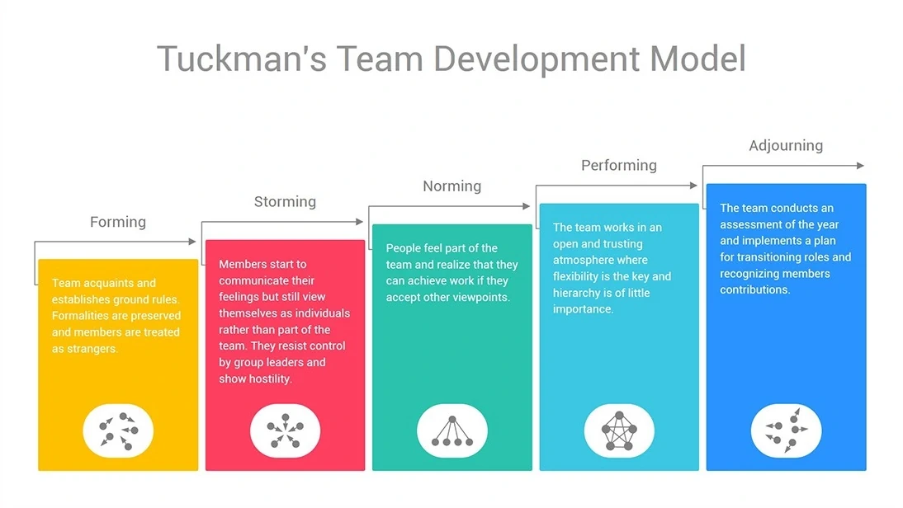

# Learning & Development

## Learning Objectives
!!! info "Learning Objectives"    

    You should define the knowledge and skill set of your target audience before starting. You can then use this information to avoid wasting time explaining information your audience already knows.   

Just as stories are used to define software, learning objectives can be written using a standard template:

_As a `user` of the `solution` I `know a specific piece of information`, or `can perform a specific task`._

### For each learning objective, you should:
Identify what your audience should know and be able to do after they have read the documentation, and/or participated in the activity. Use that information to create a list of **Learning Objectives**.

Clearly worded learning objectives enable you to focus the content on comprehensive and coherent goals. Learning objectives should be evident in the title and content.

If there is no existing documentation set, some areas will be well documented, while others will either be poorly defined or missing. Expect to find duplicate and outdated content. Maintain a list of the best documentation you find for any learning objective.

## Tuckmans - Stages of Team Development
Tuckman model is an approach to team development that helps teams understand their current state and develop strategies to move towards their goals. Tuckman (1965) identified four stages of team development, including Forming, Storming, Norming, and Performing, later extended to a Fifth stage - Adjourning.

<figure markdown>
{ width="800", loading=lazy } <figcaption>Tuckmans - Stages of Development</figcaption>
</figure>

### Five Stages of The Tuckman Model of Group Development
#### Forming
This phase occurs when new members join an existing team or organization. During this period, individuals are still learning about their roles on the team. They try to understand what they need to do to succeed. In most cases, it can take several months before people feel comfortable with one another. It may also take some time before you get your first performance review from someone who knows you well enough to give you feedback.

#### Storming
As the name suggests, this is the “storm” part of the process. Members begin to argue among themselves as they figure out where they stand within the team’s hierarchy. They might even start fighting amongst themselves. If left unchecked, this behavior could lead to severe problems down the road if not addressed immediately.

#### Norming
Once everyone feels more at ease, the team begins to work together toward common goals. People become familiar with others’ strengths and weaknesses and learn how best to use them. At this point, there should be fewer arguments between teammates because everyone understands their role on the team.

#### Performing
Finally, once all members have learned how to cooperate effectively, the team performs better than ever before. Everyone works together smoothly and efficiently towards achieving shared objectives. You know you’re ready to move into the next stage when you no longer hear anyone complain about working with other team members.

#### Adjourning
Once the goal has been achieved, the team recognizes individual contributions and then disbands. This is sometimes called the mourning stage because members feel a sense of loss after separating from those they’ve shared a meaningful experience with. Any lessons learned from the process should be passed to a responsible person for use by future teams.

### Which Factors Affect Team Performance?

The Tuckman model of group development considers three factors that affect team performance. These three factors are;

1. Content refers to what the team does, the actual work that they perform.

2. Process refers to how the team performs the work.

3. Feelings refer to how the team members relate to one another.

When a team focuses on the balance between all three, it can elevate performance.

The following table represents the team attitude on these three factors during each stage of development.

|Stages	|Content |Process |Feelings | 
| :---: | :---: | :---: | :---: |
|**Forming**|The team attempts to define the work the team needs to do.|The team might seek external guidance to define how to do the work|Team members are unsure and may need a leader to guide them|
|**Storming**|Team members may resist the task demands|Member may attempt to avoid doing the work and find reasons to do so|Friction about individual positions & hierarchy of the team|
|**Norming**|The team starts to open up about the work and challenges|	Processes start getting defined and adopted|Members become collaborative and start working collectively|
|**Performing**|The team meets work challenges and delivers|Processes ensure systematic allocation of resources and systematic workflow|	Members share common objectives and become accountable|
|**Adjouring**|In the adjourning phase, the **Leadership** acknowledges the efforts of the team and, in the process, brings about closure. |Before this occurs, however, the team is assembled one final time and individuals are encouraged to share their experiences of working at the organisation. |	It’s important that the team does not gloss over any of the problems encountered or lessons learned. This is because the solutions and insights are valuable to subsequent teams who may find themselves in similar predicaments.|

### Summary
!!! abstract ""
    The Tuckman model for team development is an excellent tool for helping teams understand their dynamics and how they interact with each other. It is one of the most widely used models for explaining group behavior. Understanding the Tuckman model helps us develop better teams and ensure effective value delivery.